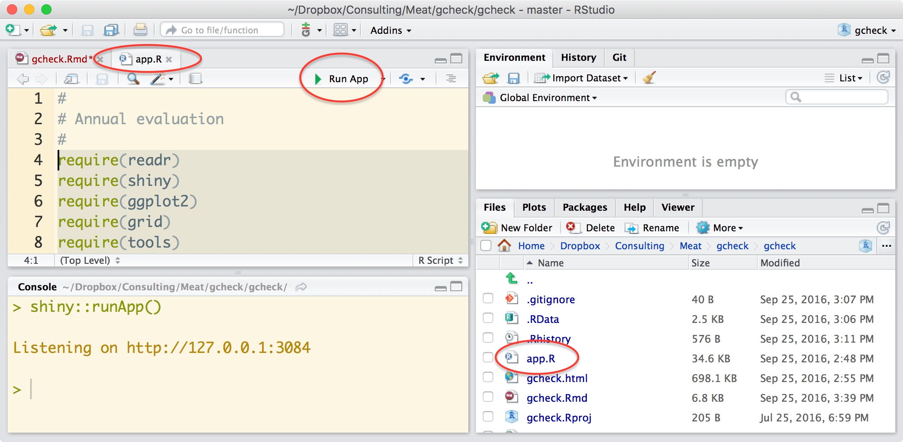

```{r setup, include=FALSE}
knitr::opts_chunk$set(echo = TRUE)
```

## Installing the app

The **gcheck** program is a shiny app running on top of R.  You can access it via the internet at [garthtarr.shinyapps.io/gcheck](https://garthtarr.shinyapps.io/gcheck/), however this involves uploading the potentially very large data file over the internet which can sometimes take time and the computer in the cloud isn't necessarily super fast, then it creates images which are downloaded back to your browser.  For large data and complex images, the process can be a bit slow.

To run the **gcheck** app locally on your computer, you need:

1. The latest version of R [https://cran.r-project.org/](cran.r-project.org).
2. The latest version of RStudio [rstudio.com/products/rstudio/download](https://www.rstudio.com/products/rstudio/download/)
3. The latest version of the **gcheck** app source code from [here](https://github.com/garthtarr/gcheck/archive/master.zip)
4. Unzip the `gcheck-master.zip` file
5. Open the `gcheck.Rproj` file.  This is an RStudio project file which should open RStudio and set the working directory to the same folder.
6. Make sure you have the necessary packages installed.  The first time doing this on a new computer (or if you update R and need to reinstall them), use:

```r
install.packages("readr")
install.packages("shiny")
install.packages("ggplot2")
install.packages("grid")
install.packages("tools")
install.packages("reshape2")
install.packages("gridExtra")
install.packages("magrittr")
install.packages("markdown")
```

6. Check that you've got the latest version of all the installed R packages.  In RStudio you can do this by going to the `Tools` dropdown menu and selecting `Check for package updates...`
7. In the **Console** window type:
```r
shiny::runApp()
```
   and press **Enter**.  Alternatively, if you have the `app.R` file open, you there will be `Run App` button in the top right of the source code window.  
   

8. This will load the **gcheck** app in a browser window.  While the app is running in the browser RStudio has to stay open.  If you close RStudio, the browser window will go grey and say it lost the connection. 

#### Troubleshooting:

Sometimes RStudio will open the app in it's own browser (rather than the operating system default (e.g. Google Chrome).  For best results the app should run in an external browser window.  You can force this behaviour from the dropdown arrow next to the `Run App` button (select `Run External`) or using

```r
shiny::runApp(launch.browser=TRUE)
```

[Google Chrome](https://www.google.com.au/chrome/browser/desktop/) is the best browser to run the app in, which may mean you may need to set it as the default browser on your computer.  Do do this, open Google Chrome, then type `chrome://settings/` in the url bar, scroll down to the section **Default browser**.

If you have issues with specific files, zip them up and send them to Garth Tarr (garth.tarr@gmail.com) with a brief description of the issue and how to replicate it.  He'll then push an update through the system to both the shinyapps server and a new version of the **gcheck** app source code to download and use on your local machine. 

Don't save any files in the `gcheck-master` folder (the one created when you unzipped `gcheck-master.zip`).  When you download a new version of the **gcheck** app, you can just delete the old folder.

## Running the gcheck app

The **gcheck** app accepts either a csv file or a zipped csv file.  Zipping the file before uploading helps reduce the file size (e.g. a 13MB csv file becomes a 2MB zip file) which means it takes considerably less time for the file to be uploaded to the server.

The file should have the following columns (not case sensitive):

`Grader`
`GradeDate`
`Hgp`
`Sex`
`TotalHscw`
`HumpCold`
`OssificationCold`
`MsaMarbling`
`RibfatCold`
`Ph`
`FeedType`

Other columns can be in the data file, but they are currently ignored.

### Subsetting the data

Once the data has been uploaded a summary of the number of carcases for each grader appears in the **Main** tab.  You can remove any graders you'd like by deleting them from the **Graders** field on the left hand side.  The tables will update to reflect the reduced data set.

If you are only interested in a particular month (or set of months) you can subset the data by choosing those months in the **Month** field and similarly for sex, HGP status and feed type.  These subsetting operations apply to all the models and plots throughout the app, for example, if you specify `January`, `February` and `March` in the **Month** field and `Grain` in the **Feed type** field, then the app will only consider reduced data set for carcases graded in the first quarter of the year who were classified as grain fed.

### Raw data tab

The raw data tab gives an overview of the data across time for the discrete variables feed type, sex and HGP status, as well as the continuous variables marbling, hump height, ossification, rib fat, pH and hot carcase weight. It introduces the violin plot and compares it to a more common density plot.

### Model outputs tab

The app fits models for each of the traits of interest, graders are then assessed on their assessments relative to what the predicted assessment would be given the statistical model.  The models are reported in the **Model outputs** tab.  An overview in terms of the $R^2$ (how well the model fits the observed data) and the residual standard deviation (how much variability is there in the residuals) is given in the **Predictive ability** section. $R^2$ values in the range of 20-30% are common for marbling, hump height, ossification and rib fat.  The $R^2$ value for the pH model is likely to be very small, as the other variables have very little influence on the observed pH -- the residuals from the pH model are more or less recentered (mean zero) versions of the original pH score.

Below the **Predictive ability** summary table is the raw output for each model so you can see what variables went into each model and their relative importance.

### Grader assessment

The **Grader assessment** tab shows the average residual, standard deviation of the residuals and effect size broken down by grader for each measured trait.  This tab provides averages over time (though time is taken into account in the modelling procedure).

While the average residual is perhaps easy to understand (as the mean difference between the grader's assessment and the predicted assessment given the other variables), the effect size is more useful in determining whether there is an important difference or not. The effect size is the difference in average residual score divided by the overall residual standard deviation -- so it takes the variability into account. The numbers given in the table are the effect size relative to zero. It's better to consider the difference in effect size between any two graders, for example if one grader had an effect size of 0.3 and another had an effect size of -0.4 then the effect size between the two graders would be 0.7. A small effect size is 0.2, medium (probably worth investigating further) is around 0.5 and large (quite unusual) would be 0.8 or more.

Below the tables are violin plots showing the distribution of the original data and the residuals for each trait broken down by grader.  This also helps highlight differences in the shape and structure of the assessments of individual graders.  For example some graders have very lumpy hump height distributions.  Other graders give a very limited range of scores for some traits relative to other graders.

### Monthly plots

The **Monthly plots** tab shows how the average residual (or effect size) changes over time.  The size of the dot is indicative of the number of carcases graded in a given month.  Very small dots should be treated with caution, there's probably not enough data to make an informed assessment of their performance.  The lines between points only serve to link the dots together to make it easier to see if a grader is consistently returning negative residuals or positive residuals over time (each grader is allocated a unique colour as shown in the legend on the right).  

### Monthly summary

The **Monthly summary** tab gives the same information as the **Monthly plots** tab, in table form rather than as a plot.  It breaks down the average residual, residual standard deviation and effect sizes by grader and month.  You need to choose the grader of interest from the drop down menu on the left.


